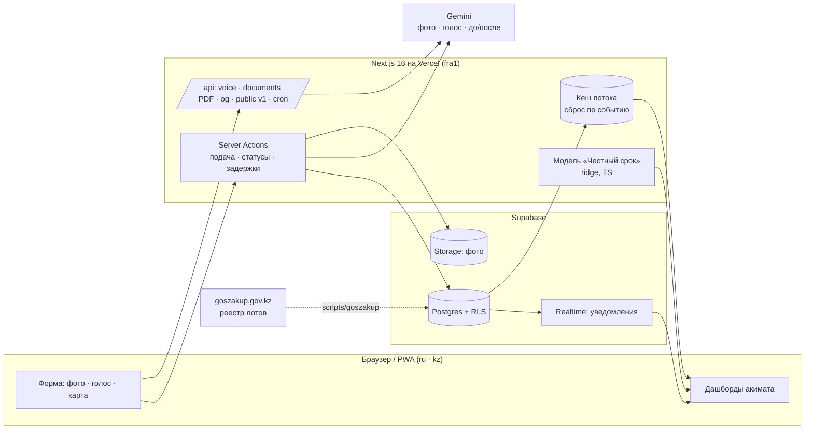

# AIQYN — прозрачность городских обращений Актау

**Сайт:** https://aiqyn-aktau.vercel.app · хакатон «Smart City Aktau», Mangystau Hub.
Русский и казахский, работает с телефона, ставится на главный экран как приложение.

> В Актау проблема не в том, что жалобу некуда подать. Проблема в том, что после подачи ничего не видно:
> все получают одинаковые «15 рабочих дней», акимат не видит, что сорвётся завтра, а обращения закрывают отписками.
> AIQYN превращает жалобу в отслеживаемое обязательство — с честным сроком, доказательствами и видимым результатом.

AIQYN не заменяет контакт-центр 109 и eOtinish — это публичный слой поверх них, который связывает
жителя, службу, акимат и бюджет города.

## Демо-аккаунты

Пароль: **`aiqyn2026`** (на странице входа есть кнопки быстрого входа).

| Роль | Email | Что смотреть |
|---|---|---|
| Житель | `citizen@aiqyn.kz` | обращение по фото или голосом, «Мои обращения», голосование «сделано / не сделано», «В бюджет» |
| Акимат | `akimat@aiqyn.kz` | обзор, «Под угрозой срыва», отчёт акиму (PDF), индекс боли, качество служб, деньги и жалобы; может действовать и как служба |

## Сквозной сценарий

1. **Жалоба за 30 секунд.** Житель фотографирует проблему (камера или галерея, iPhone и Android) или
   **рассказывает голосом** по-русски или по-казахски. ИИ заполняет категорию, заголовок и описание на двух языках,
   серьёзность; точка ставится по геометке фото, по телефону или по названному микрорайону.
2. **Фильтр мусора.** Тёмное/размытое/пустое фото, бессмыслица, мат, повтор с того же места, больше 5 обращений в час —
   не пройдут. ИИ отличает городскую проблему от селфи и игнорирует текст-команды на фото.
3. **Маршрутизация.** Система сама определяет службу («яма после раскопок» → КЖСА, а не дорожники), микрорайон,
   соцобъекты рядом (школа → приоритет выше) и дубликаты поблизости.
4. **Два срока вместо одного.** Юридический срок (15 рабочих дней по АППК РК, ст. 76, с праздниками РК) и
   **«Честный срок»** — прогноз модели, когда реально решат, с интервалом и вероятностью срыва.
5. **Служба работает публично.** Приняла → в работу → закрыть можно только с фото «после»: сверяются геометка (≤100 м),
   время съёмки и **ИИ сравнивает фото «до» и «после»** — та же проблема или другое место не закроются.
   Задерживается — служба публично указывает **причину** («нет финансирования», «ждём закупку»…).
6. **Решают жители.** Заявка не закрывается сама: жители голосуют «сделано / не сделано», «не сделано» → переоткрытие.
7. **Акимат видит будущее.** «Под угрозой срыва» (что сорвётся в ближайшие 7 дней), индекс боли, хронические точки,
   качество служб, **отчёт акиму одной кнопкой** (PDF на 2 страницы, ru/kz).
8. **Бюджет.** «Народный заказ к бюджету»: жалобы по направлениям бюджета, **«Застряло из-за денег»**,
   **«Жалоб много — контрактов почти нет»** и **«Контракты есть — жалобы остались»** на реальных данных госзакупок;
   PDF для депутатов маслихата; застрявшее обращение одной кнопкой становится проектом для бюджета народного участия.
9. Срок сорван → пакет для **eOtinish** (текст, хронология, фото, подтверждения, PDF). Отправку не имитируем — подаёт житель.

## Архитектура



## Ключевые механики

| Механика | Файл |
|---|---|
| «Честный срок»: ridge-регрессия (категория×район, ×месяц, ×загрузка), локальная калибровка по Актау | `lib/honest-deadline.ts`, `ml/honest_deadline/` |
| ИИ по фото: категория, заголовок ru/kz, серьёзность, защита от текст-команд | `lib/ai-vision.ts`, `lib/gemini.ts` |
| Голосовая жалоба: запись WAV в браузере → расшифровка → карточка + микрорайон из справочника | `components/reports/voice-button.tsx`, `lib/ai-voice.ts`, `app/api/voice` |
| ИИ-сверка фото «до/после», блокировка очевидной отписки | `lib/ai-compare.ts`, `submitCompletion` в `lib/actions/reports.ts` |
| Проверка качества обращения (текст, фото, лимиты) | `lib/report-quality.ts` |
| SLA в рабочих днях, праздники РК, переносы | `lib/sla.ts` |
| Приоритет из 7 слагаемых с разбивкой | `lib/priority.ts` |
| Классификатор и маршрутизация ru+kz | `lib/classify.ts`, `lib/routing.ts` |
| Дедупликация (120 м, 30 дней) и хронические точки (DBSCAN) | `lib/dedupe.ts`, `lib/clustering.ts` |
| Голосование жителей и переоткрытие | `lib/verification.ts` |
| Детектор ответов-отписок | `lib/boilerplate.ts` |
| Индекс боли микрорайона на 1000 жителей | `lib/pain-index.ts` |
| Причина задержки и «Застряло из-за денег» | `lib/delay.ts`, `lib/budget-demand.ts` |
| Отчёт акиму и «Народный заказ» (PDF) | `lib/digest.ts`, `lib/pdf/` |
| Источник запаха по ветру, риск дорог | `lib/wind.ts`, `lib/road-risk.ts` |
| Кеш потока обращений со сбросом по событию | `lib/data.ts`, `lib/cache-tags.ts` |
| Лимит частоты ИИ | `lib/rate-limit.ts` |

Тесты: `npm test` (21 тест: SLA, приоритет, классификатор, проверки качества, паритет модели «Честный срок» TS↔Python).

## Данные: что реальное, а что модельное

| Данные | Статус | Источник |
|---|---|---|
| Обращения жителей | **реальные** | подаются на сайте; `reports.is_synthetic = false` |
| Модельный поток ~830 обращений | **модельные, помечены** | `reports.is_synthetic = true`, номера `AQ-2026-9xxxx`; реальные микрорайоны, службы и сезонность, одинаковые вероятности для всех служб — различия не являются оценкой организаций. Не попадают в открытый API, очереди служб и поиск дублей |
| Госзакупки | **реальные** | 159 лотов 2024–2026 гг. (35,1 млрд тенге) городских отделов Актау со статусом «Закупка состоялась» из открытого реестра лотов goszakup.gov.kz, у каждого ссылка; `scripts/goszakup/` |
| Модель «Честный срок» | **обучена на реальных данных** | 307 653 обращения NYC 311 (2024–2025): ошибка срока на 59% ниже «15 рабочих дней», покрытие интервала 80%, AUC срыва 0,86 |
| География | **реальная** | OpenStreetMap (ODbL): 84 микрорайона, дороги, адреса, соцобъекты |
| Погода и ветер | **реальные** | Open-Meteo (CC BY 4.0) |
| Кейсы из прессы | **реальные** | lada.kz, inaktau.kz, newsroom.kz и др., с датой и ссылкой |
| Население микрорайонов | **оценка** | 303 752 жителя (lada.kz, 12.2025) распределены по жилой площади зданий OSM |

Полный список с лицензиями — [`data/SOURCES.md`](data/SOURCES.md).

## Безопасность

- RLS на всех таблицах; запись — только через серверные действия после проверки роли.
- Лимиты: 5 обращений в час, голос 10 / фото-ИИ 20 запросов за 10 минут на пользователя.
- ИИ не распознаёт лица и номера машин, только отмечает их наличие; текст на фото и в речи — данные, а не команды.
- Заголовки безопасности (nosniff, SAMEORIGIN, Permissions-Policy: камера/микрофон/геолокация только для сайта).

## Запуск локально

```bash
npm install
cp .env.example .env.local   # Supabase URL/ключи, GEMINI_API_KEY (бесплатный ключ aistudio.google.com)
npm run dev                  # http://localhost:3000
```

Данные:

```bash
node scripts/fetch-osm.mjs && node scripts/fetch-weather.mjs && node scripts/build-districts.mjs
node scripts/seed-reference.mjs                                   # справочники, погода, дороги → Supabase
npx tsx scripts/seed-press.mts                                    # реальные кейсы из СМИ
node --env-file=.env.local --import tsx scripts/seed-synthetic.mts   # модельный поток (is_synthetic)
python scripts/goszakup/fetch_lots.py                             # реальные лоты госзакупок → data/
node --env-file=.env.local scripts/goszakup/import.mjs            # → таблица procurements
node --env-file=.env.local scripts/check-vision.mjs photo.jpg     # проверка ключа ИИ
```

Миграции БД — `supabase/migrations/` (0001–0014).

## Открытый API

```
GET /api/public/v1/reports?status=open&category=road_pit&district=mkr-3
GET /api/public/v1/reports?format=geojson
```

Только реальные обращения, без персональных данных.

## Стек

Next.js 16 (App Router, Server Actions) · React 19 · TypeScript · Tailwind 4 + shadcn/ui ·
Supabase (Postgres, Auth, Storage, Realtime, RLS) · Gemini (фото, голос, сверка «до/после») ·
Leaflet + OpenStreetMap · @react-pdf/renderer · Vercel (fra1) · Python/scikit-learn (обучение модели сроков).
